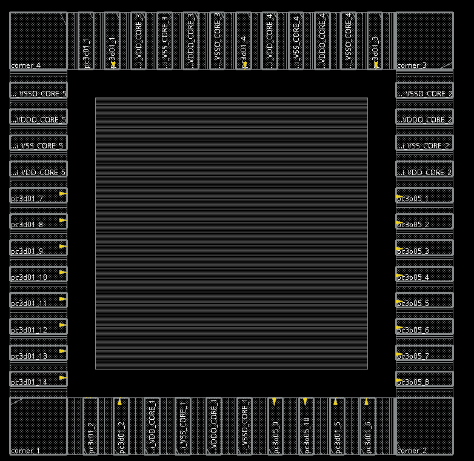
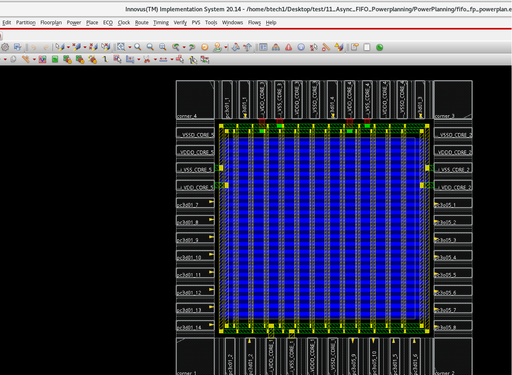
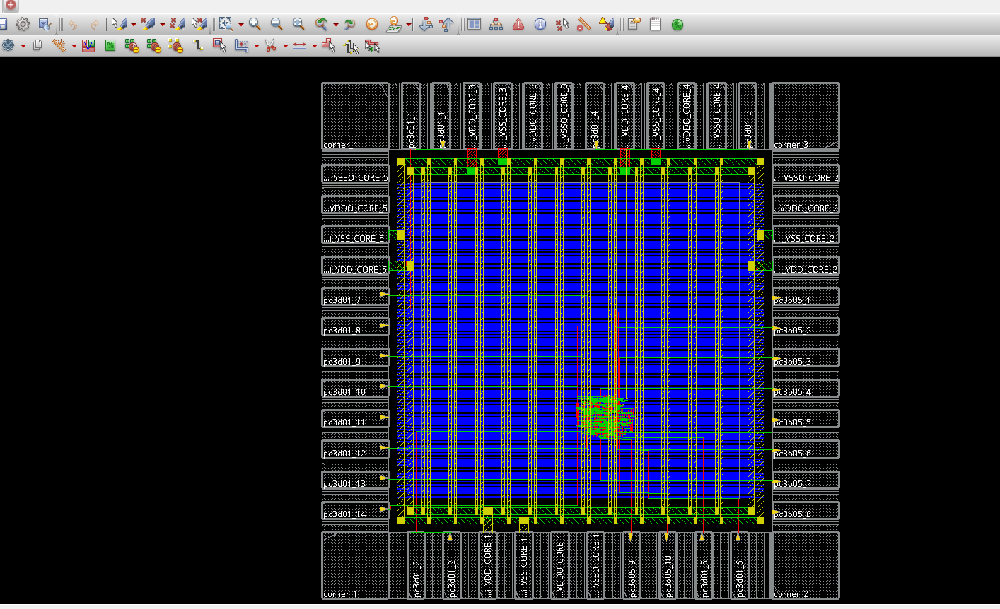
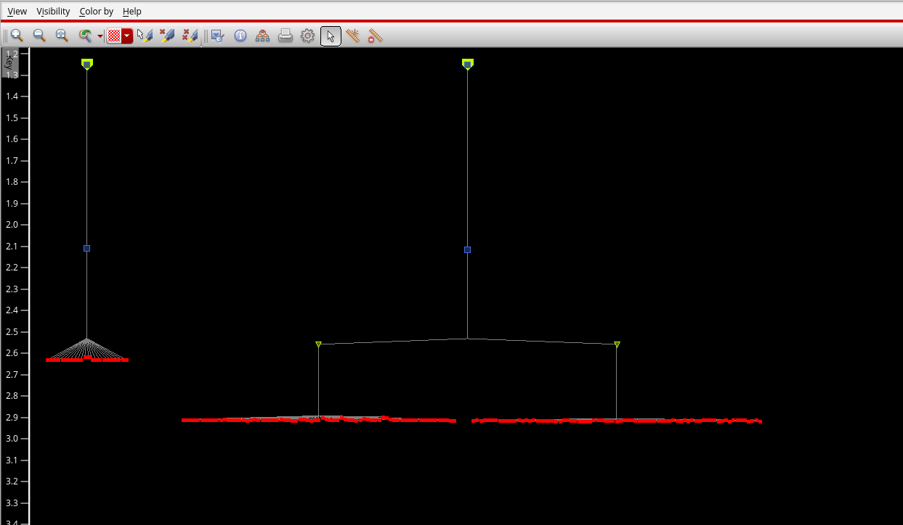
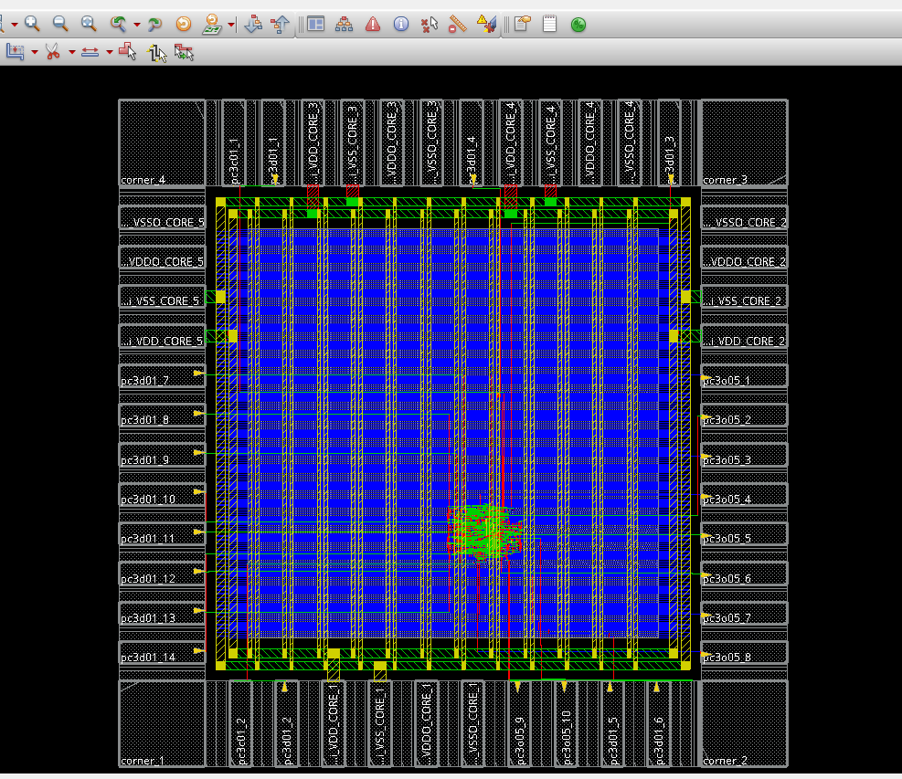

# RTL-to-GDSII Design Flow of Asynchronous FIFO

This repository documents the complete RTL-to-GDSII physical design implementation of an asynchronous FIFO using Cadence Genus and Innovus, targeting a 180 nm technology node. The project focuses on executing the end-to-end ASIC design flow and analyzing synthesis and physical design results.

---

## Overview

The objective of this project is to perform full-chip physical design starting from synthesizable RTL and ending with final GDSII generation. The flow includes synthesis, floorplanning, power planning, placement, clock tree synthesis (CTS), and routing, along with report analysis at each stage.

---

## Design Flow Stages

### 1. Synthesis
Logic synthesis of the asynchronous FIFO RTL was performed using Cadence Genus to map the design onto a 180 nm standard-cell library and generate area and power reports.

---

### 2. Floorplanning
Initial floorplan was created in Cadence Innovus by defining the core area, aspect ratio, and IO placement to establish the physical layout foundation.

  

---

### 3. Power Planning
Power distribution network (PDN) was implemented including power rings and straps to ensure robust VDD/VSS delivery across the design.

  

---

### 4. Placement
Standard cells were placed and optimized to minimize congestion and meet timing requirements while maintaining efficient utilization.

  

---

### 5. Clock Tree Synthesis (CTS)
Clock tree was synthesized to balance clock latency and skew, ensuring reliable clock distribution across sequential elements.  
CTS results were analyzed using the Innovus CTS Debugger to inspect clock skew, latency, and tree structure.

  

---

### 6. Routing
Global and detailed routing were performed to complete signal interconnections, followed by timing and design rule verification.

  

---

## Results and Reports
Post-implementation reports were analyzed to evaluate design quality, including timing closure, area utilization, and power characteristics after physical design.

Key generated outputs include:
- Post-synthesis area and power reports (Genus)
- Timing and QoR reports after placement and routing (Innovus)
- Final routed layout and GDSII database

---

## Tools Used
- Cadence Genus – RTL synthesis and report generation  
- Cadence Innovus – Physical design implementation (Floorplan → GDSII)

---

## Repository Structure

async-fifo-rtl-to-gdsii/
│── scripts/ # Genus and Innovus TCL scripts
│── reports/ # Area, power, and timing reports
│── docs/ # Screenshots: synthesis, floorplan, CTS, routing
│── results/ # Final outputs (GDSII if permitted)
│── README.md
